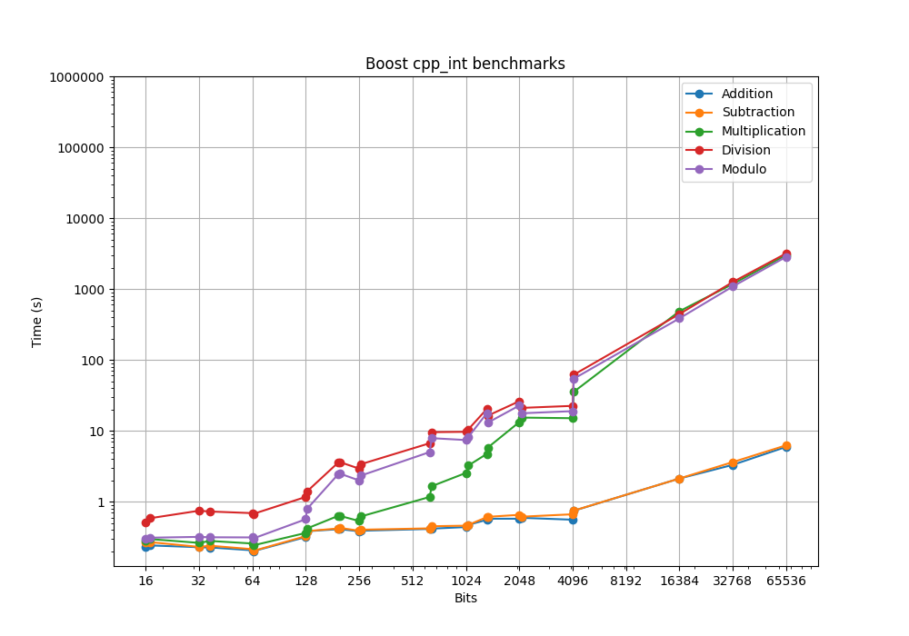
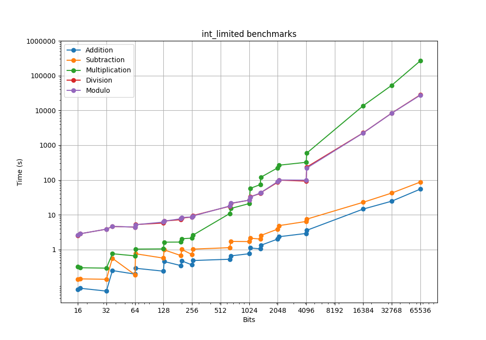

# Benchmark results

All benchmarks were run with O2 optimization, unless stated differently.

## Comparison

Unique test numbers in benchmark: 5000 (Including 0, 1, -1) \
Total calculations per test: 25000000 \
Times were averaged over 10 different benchmark iterations \
Initial RandState (for rng): 1

| Type               | Addition           | Subtraction        | Multiplication     | Division           | Modulo             |
| ---                | ---                | ---                | ---                | ---                | ---                |
| int128             | 0.0303             | 0.0564             | 0.1935             | 2.2131             | 1.8864             |
| int_limited<128>   | 0.2405             | 0.5703             | 1.0495             | 5.8177             | 6.1988             |
| Boost int128       | 0.1039             | 0.0968             | 0.0882             | 0.5873             | 0.6053             |
| cpp_int (128 bits) | 0.3179             | 0.3271             | 0.3634             | 1.1699             | 0.5671             |
| int_limited<256>   | 0.3638             | 0.7201             | 2.1351             | 8.6637             | 8.7123             |
| cpp_int (256 bits) | 0.3835             | 0.3906             | 0.5353             | 2.9327             | 1.9982             |

## int_limited

Unique test numbers in benchmark: 5000 (Including 0, 1, -1) \
Total calculations per test: 25000000 \
Times were averaged over 10 different benchmark iterations \
Initial RandState (for rng): 1

| Type               | Addition           | Subtraction        | Multiplication     | Division           | Modulo             |
| ---                | ---                | ---                | ---                | ---                | ---                |
| int_limited<16>    | 0.0714             | 0.1413             | 0.3215             | 2.5662             | 2.6206             |
| int_limited<17>    | 0.0776             | 0.1442             | 0.3017             | 2.8657             | 2.8684             |
| int_limited<32>    | 0.0644             | 0.1408             | 0.2943             | 3.8724             | 3.8743             |
| int_limited<37>    | 0.2504             | 0.5642             | 0.7627             | 4.6241             | 4.6454             |
| int_limited<64>    | 0.1982             | 0.1899             | 0.6620             | 4.4423             | 4.4467             |
| int_limited<65>    | 0.2914             | 0.7612             | 1.0373             | 5.2468             | 5.1995             |
| int_limited<128>   | 0.2405             | 0.5703             | 1.0495             | 5.8177             | 6.1988             |
| int_limited<130>   | 0.4560             | 0.9849             | 1.6398             | 6.6301             | 6.5857             |
| int_limited<196>   | 0.3471             | 0.6728             | 1.6483             | 7.2759             | 7.7283             |
| int_limited<199>   | 0.4753             | 1.0176             | 2.0562             | 8.0510             | 8.3523             |
| int_limited<256>   | 0.3638             | 0.7201             | 2.1351             | 8.6637             | 8.7123             |
| int_limited<262>   | 0.4866             | 1.0344             | 2.6054             | 9.5269             | 9.2466             |
| int_limited<640>   | 0.5296             | 1.1395             | 10.8939            | 17.6029            | 17.9414            |
| int_limited<657>   | 0.6617             | 1.7252             | 15.2187            | 21.2272            | 21.5569            |
| int_limited<1024>  | 0.7613             | 1.7044             | 21.0095            | 26.3457            | 26.3187            |
| int_limited<1055>  | 1.1180             | 2.1282             | 57.5191            | 33.1752            | 32.4150            |

Unique test numbers in benchmark: 2000 (Including 0, 1, -1) \
Total calculations per test: 4000000 \
Times were averaged over 10 different benchmark iterations \
Initial RandState (for rng): 1

| Type               | Addition           | Subtraction        | Multiplication     | Division           | Modulo             |
| ---                | ---                | ---                | ---                | ---                | ---                |
| int_limited<1344>  | 0.1681             | 0.3228             | 11.8375            | 6.5521             | 6.7610             |
| int_limited<1360>  | 0.2130             | 0.4082             | 19.1456            | 6.9174             | 6.9486             |
| int_limited<2048>  | 0.3218             | 0.6196             | 35.7394            | 13.7817            | 14.3727            |
| int_limited<2107>  | 0.3753             | 0.7814             | 42.5559            | 15.9081            | 16.0382            |
| int_limited<4096>  | 0.4671             | 1.0319             | 51.6335            | 14.9080            | 15.8929            |
| int_limited<4159>  | 0.5745             | 1.2039             | 94.9872            | 37.7061            | 35.2969            |

Unique test numbers in benchmark: 200 (Including 0, 1, -1) \
Total calculations per test: 40000 \
Times were averaged over 10 different benchmark iterations \
Initial RandState (for rng): 1

| Type               | Addition           | Subtraction        | Multiplication     | Division           | Modulo             |
| ---                | ---                | ---                | ---                | ---                | ---                |
| int_limited<16384> | 0.0234             | 0.0367             | 21.8284            | 3.6319             | 3.6015             |
| int_limited<32768> | 0.0395             | 0.0676             | 84.3621            | 13.4118            | 13.3225            |
| int_limited<65536> | 0.0876             | 0.1398             | 425.1701           | 44.8254            | 43.8209            |

## Boost results

Unique test numbers in benchmark: 5000 (Including 0, 1, -1) \
Total calculations per test: 25000000 \
Times were averaged over 10 different benchmark iterations \
Initial RandState (for rng): 1

| Type               | Addition          | Subtraction       | Multiplication    | Division          | Modulo            |
| ---                | ---               | ---               | ---               | ---               | ---               |
| cpp_int (16 bits)  | 0.2306            | 0.2683            | 0.2824            | 0.5066            | 0.2972            |
| cpp_int (17 bits)  | 0.2421            | 0.2695            | 0.2974            | 0.5869            | 0.3113            |
| cpp_int (32 bits)  | 0.2285            | 0.2309            | 0.2632            | 0.7474            | 0.3199            |
| cpp_int (37 bits)  | 0.2267            | 0.2397            | 0.2801            | 0.7286            | 0.3156            |
| cpp_int (64 bits)  | 0.2067            | 0.2144            | 0.2577            | 0.6913            | 0.3143            |
| cpp_int (65 bits)  | 0.2011            | 0.2034            | 0.2431            | 0.6760            | 0.3046            |
| cpp_int (128 bits) | 0.3179            | 0.3271            | 0.3634            | 1.1699            | 0.5671            |
| cpp_int (130 bits) | 0.3839            | 0.3856            | 0.4197            | 1.3948            | 0.7900            |
| cpp_int (196 bits) | 0.4104            | 0.4207            | 0.6354            | 3.6108            | 2.4752            |
| cpp_int (199 bits) | 0.4107            | 0.4284            | 0.6333            | 3.6332            | 2.5006            |
| cpp_int (256 bits) | 0.3835            | 0.3906            | 0.5353            | 2.9327            | 1.9982            |
| cpp_int (262 bits) | 0.3901            | 0.4035            | 0.6208            | 3.3870            | 2.3390            |
| cpp_int (640 bits) | 0.4137            | 0.4216            | 1.1690            | 6.6893            | 5.0190            |
| cpp_int (657 bits) | 0.4178            | 0.4517            | 1.6568            | 9.5852            | 7.8858            |
| cpp_int (1024 bits)| 0.4397            | 0.4597            | 2.5486            | 9.6915            | 7.4226            |
| cpp_int (1055 bits)| 0.4721            | 0.4715            | 3.2330            | 10.4293           | 8.1353            |

Unique test numbers in benchmark: 2000 (Including 0, 1, -1) \
Total calculations per test: 4000000 \
Times were averaged over 10 different benchmark iterations \
Initial RandState (for rng): 1

| Type               | Addition          | Subtraction       | Multiplication    | Division          | Modulo            |
| ---                | ---               | ---               | ---               | ---               | ---               |
| cpp_int (1344 bits)| 0.0890            | 0.0970            | 0.7568            | 3.2526            | 2.8329            |
| cpp_int (1360 bits)| 0.0923            | 0.0981            | 0.9268            | 2.6146            | 2.0848            |
| cpp_int (2048 bits)| 0.0922            | 0.1046            | 2.1232            | 4.1874            | 3.6365            |
| cpp_int (2107 bits)| 0.0951            | 0.0985            | 2.4621            | 3.3725            | 2.8306            |
| cpp_int (4096 bits)| 0.0893            | 0.1066            | 2.4132            | 3.6020            | 3.0344            |
| cpp_int (4159 bits)| 0.1194            | 0.1200            | 5.6806            | 9.9040            | 8.6972            |

Unique test numbers in benchmark: 200 (Including 0, 1, -1) \
Total calculations per test: 40000 \
Times were averaged over 10 different benchmark iterations \
Initial RandState (for rng): 1

| Type                | Addition          | Subtraction       | Multiplication    | Division          | Modulo            |
| ---                 | ---               | ---               | ---               | ---               | ---               |
| cpp_int (16384 bits)| 0.0034            | 0.0034            | 0.7769            | 0.7092            | 0.6164            |
| cpp_int (32768 bits)| 0.0053            | 0.0058            | 1.8816            | 2.0069            | 1.7368            |
| cpp_int (65536 bits)| 0.0095            | 0.0100            | 4.8134            | 5.0805            | 4.5448            |
